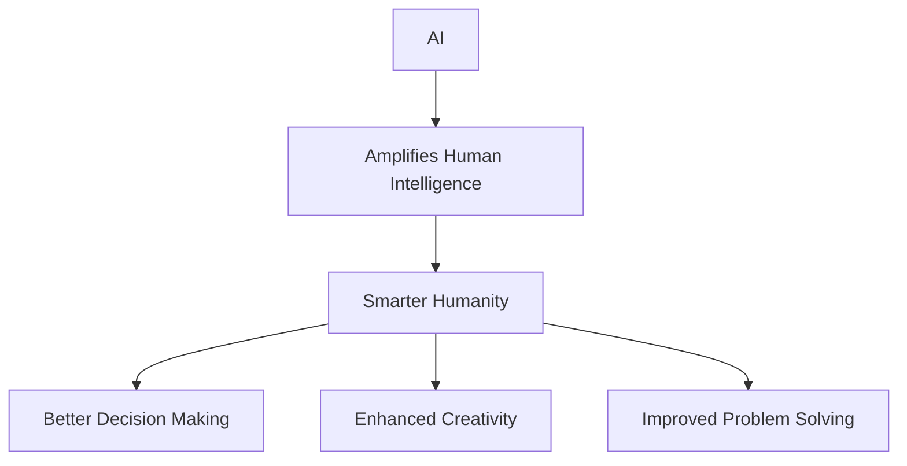

import { Callout, Steps, Step } from "nextra-theme-docs";

# Empowering Human Goodness

Yann LeCun, Chief AI Scientist at Meta, believes that AI, especially open source AI, can empower the fundamentally good nature of humans. By making AI accessible to a wider audience through open source platforms, we can harness the collective intelligence and goodwill of humanity to create a better future.

## The Power of Open Source AI

Open source AI has the potential to:

- Democratize access to advanced AI technologies
- Encourage collaboration and knowledge sharing among researchers and developers
- Foster innovation by allowing anyone to build upon existing AI models and architectures
- Ensure transparency and accountability in the development of AI systems

By making AI accessible to everyone, we can tap into the diverse perspectives and experiences of people from all walks of life, leading to more inclusive and equitable AI solutions.

<Callout emoji="💡">
Open source AI platforms like [Meta's LLaMA](https://ai.facebook.com/blog/large-language-model-llama-meta-ai/) are paving the way for a more collaborative and inclusive future in AI development.
</Callout>

## Amplifying Human Intelligence

LeCun argues that AI will amplify human intelligence, making humanity smarter as a whole. Just as the invention of the printing press revolutionized access to knowledge and sparked the Age of Enlightenment, AI has the potential to unlock new frontiers of human understanding and creativity.

By leveraging AI as a tool to augment our cognitive abilities, we can:

- Make better decisions based on data-driven insights
- Enhance our creativity by exploring novel ideas and solutions
- Improve our problem-solving skills by analyzing complex issues from multiple angles

## Addressing Bias and Ensuring Diversity

One of the key challenges in developing AI systems is addressing inherent biases that may arise from training data or algorithmic design. Open source AI can help mitigate this issue by:

- Encouraging diverse participation in AI development
- Allowing for public scrutiny and auditing of AI models
- Enabling the creation of AI systems tailored to specific cultural, linguistic, and regional contexts

<Steps>

### Step 1
Recognize that bias in AI systems is inevitable, as it reflects the biases present in society and the data used to train these systems.

### Step 2
Embrace open source AI platforms to ensure transparency, accountability, and diversity in AI development.

### Step 3
Actively seek out and include diverse perspectives in the development and deployment of AI systems to minimize bias and promote fairness.

</Steps>

By acknowledging and actively addressing bias, we can create AI systems that empower the goodness in humans across all segments of society.

## Conclusion

Yann LeCun's vision of open source AI as a means to empower human goodness is both inspiring and attainable. By democratizing access to AI technologies, amplifying human intelligence, and ensuring diversity in AI development, we can create a future in which AI serves as a powerful tool for unlocking the best in humanity. As we continue to advance in the field of [AI and machine learning](/introduction), it is crucial that we keep these principles at the forefront of our efforts.