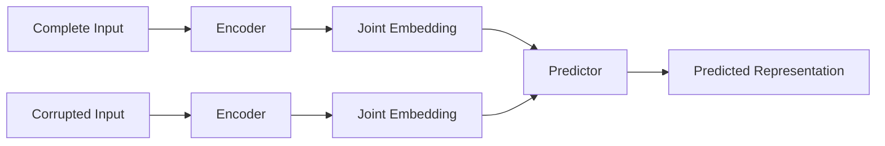

import { Callout, Steps, Step } from "nextra-theme-docs";

# Joint Embedding Architectures

Yann LeCun advocates for joint embedding predictive architectures (JEPAs) as a better approach to AI compared to generative models like autoregressive LLMs. JEPAs work by learning abstract representations of the input data in a self-supervised manner, without attempting to reconstruct every detail of the situation.

The main idea behind JEPAs is to:

1. Take a complete input (e.g., an image or video) and a corrupted, transformed, or masked version of the input.
2. Run both inputs through encoders to obtain joint embeddings.
3. Train a predictor to predict the representation of the complete input from the representation of the corrupted input.

This process allows the system to learn abstract representations that capture the essential information about the world while ignoring irrelevant details.

<Callout emoji="✅">
JEPAs are more efficient than generative models because they don't need to predict every pixel of the input, focusing instead on learning useful representations.
</Callout>

The training process for JEPAs involves [non-contrastive methods](/joint-embedding-architectures/non-contrastive-methods), which have shown promising results in learning good representations of images and videos. These methods help prevent the system from collapsing and learning trivial solutions.

One of the key applications of JEPAs is in building [world models from video data](/joint-embedding-architectures/world-models-from-video). By learning to predict the representation of a complete video from a partially masked video, the system can develop an understanding of the physical constraints and dynamics of the world.

The success of JEPAs in learning good representations from sensory data is a crucial step towards developing AI systems with a deeper understanding of the world. These architectures lay the foundation for more advanced capabilities, such as [reasoning, planning, and hierarchical representations](/reasoning-planning-hierarchical-representations).