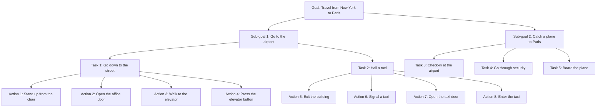

import { Callout, Steps, Step } from "nextra-theme-docs";

# Learning Hierarchical Representations

Learning hierarchical representations of action plans is a crucial challenge in AI research. To understand the importance of this task, let's consider the example of planning a trip from New York to Paris, as mentioned by Yann LeCun in the podcast.

<Steps>
### Step 1: High-level planning

At the highest level, you might break down the task into two sub-goals:
1. Go to the airport
2. Catch a plane to Paris

### Step 2: Mid-level planning

Each sub-goal can be further divided into smaller tasks:
- Going to the airport:
  - Go down to the street
  - Hail a taxi
- Catching a plane to Paris:
  - Check-in at the airport
  - Go through security
  - Board the plane

### Step 3: Low-level planning

At the lowest level, each task can be broken down into a sequence of actions:
- Going down to the street:
  - Stand up from the chair
  - Open the office door
  - Walk to the elevator
  - Press the elevator button
- Hailing a taxi:
  - Exit the building
  - Signal a taxi
  - Open the taxi door
  - Enter the taxi
</Steps>

As humans, we effortlessly plan and execute tasks at various levels of abstraction. However, for AI systems, learning to do this remains a significant challenge. Current AI systems can perform hierarchical planning when the levels of representation are designed by hand, but learning these hierarchical representations autonomously is an open problem.

<Callout type="info">
Hierarchical planning is essential for AI systems to efficiently solve complex tasks by breaking them down into manageable sub-goals and actions at different levels of abstraction.
</Callout>

To illustrate the concept of hierarchical representations, consider the following diagram:

Researchers are exploring various approaches to learning hierarchical representations, such as:

- Hierarchical reinforcement learning
- Goal-conditioned policies
- Option frameworks

However, there is still a long way to go before AI systems can learn hierarchical representations as efficiently and flexibly as humans do.

In conclusion, learning hierarchical representations of action plans is a critical step towards developing AI systems that can reason, plan, and solve complex tasks in a more human-like manner. Addressing this challenge will require innovative approaches and continued research efforts in the field of AI.